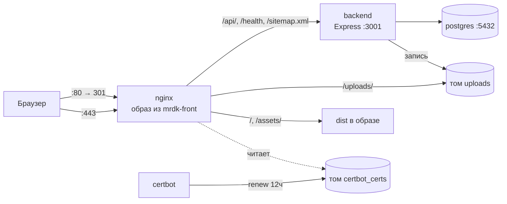

# Архитектура МРДК

Как система устроена в рантайме: путь запроса, схема данных, карта модулей, сквозные конвейеры.

**Чего здесь нет — и где это искать.** Документ намеренно не пересказывает соседей и не копирует объяснения «почему так»:

- **что это за проект, стек, локальный запуск, деплой, бэкапы, переменные окружения** — [README.md](README.md);
- **инварианты и договорённости при правках** (порядок сборки, лимиты памяти, ESM-расширения, миграции, синхронность CSP и sitemap) — [CLAUDE.md](CLAUDE.md);
- **причины конкретных решений** — комментарии рядом с кодом: [deploy.sh](deploy.sh), [backup.sh](backup.sh), [restore.sh](restore.sh), [nginx/nginx.conf](nginx/nginx.conf), [docker-compose.yml](docker-compose.yml), оба Dockerfile, [mrdk-back/.env.example](mrdk-back/.env.example).

Если ответ на вопрос есть в комментарии у кода — правится комментарий, а не этот файл.

---

## Топология



Наружу опубликован только nginx (80/443). Бэкенд портов не публикует — до него можно достучаться лишь через прокси. Postgres опубликован на `127.0.0.1:5432`: снаружи недоступен, но с самого сервера доступен для `psql` и дампов.

Тома: `postgres_data`, `uploads` (у бэкенда `/app/uploads` на запись, у nginx `/var/www/uploads` только на чтение), `certbot_certs`, `certbot_www`.

## Путь запроса

Всё входит через nginx. `:80` умеет только ACME-челлендж и редирект на HTTPS. Разбор `:443` по префиксам:

| location | Куда | Кэш |
|---|---|---|
| `/api/` | бэкенд, префикс срезается `rewrite` | — |
| `/health`, `= /sitemap.xml` | бэкенд | sitemap: 1 ч (ставит контроллер) |
| `~ ^/(?!api/\|uploads/)(.+)/$` | 301 без хвостового слэша | — |
| `/uploads/` | `alias` на том загрузок | 30 дней, `immutable` |
| `/assets/` | `dist` в образе (хэш в имени) | 1 год, `immutable` |
| `~ ^/(video\|fonts)/` | `dist` в образе | 7 дней |
| `/` | `try_files $uri $uri/index.html /index.html` | `no-cache` |

Последняя строка — вся маршрутизация публичного сайта: сначала пробуется пререндеренный `dist/events/index.html`, затем SPA-фолбэк на корневой `index.html`.

CSP отдаётся в двух местах: `nginx.conf` (действует на страницу — главный) и helmet в [app.ts](mrdk-back/src/app.ts) (только ответы API). Они обязаны совпадать.

## Схема данных

| Таблица | Колонки | Связи |
|---|---|---|
| `users` | `id`, `name`, `login` (UNIQUE), `password_hash`, `role`, `created_at` | — |
| `events` | `id`, `title`, `description`, `image_path` (NULL допустим — обложка необязательна), `event_date` (`DATE`), `created_at`, `updated_at` | ← `event_images`, `event_videos` |
| `event_images` | `id`, `event_id`, `image_path`, `created_at` | FK → `events`, `ON DELETE CASCADE` |
| `event_videos` | `id`, `event_id`, `video_path`, `created_at` | FK → `events`, `ON DELETE CASCADE` |
| `reminders` | `id`, `title`, `image_path` **NOT NULL**, `created_at`, `updated_at` | — |
| `workplan` | `id`, `title`, `year`, `month` (`SMALLINT`, оба nullable), `document_path`, `original_name`, `created_at`, `updated_at` | — |
| `documents` | `id`, `title`, `document_path`, `original_name`, `created_at`, `updated_at` | — |
| `clubs` | `id`, `name`, `leader`, `created_at`, `updated_at` | — |
| `schema_migrations` | `filename` (PK), `applied_at` | служебная, ведёт [migrate.ts](mrdk-back/src/config/migrate.ts) |

**Индексы.** `idx_events_created_at` на `events(created_at DESC)`; `idx_event_images_event_id`, `idx_event_videos_event_id` — под внешние ключи (Postgres их сам не создаёт); `idx_workplan_year_month` на `workplan(year DESC NULLS LAST, month DESC NULLS LAST, created_at DESC)`.

⚠️ Публичный список событий сортируется по `event_date DESC NULLS LAST, id DESC`, а индекса на `event_date` нет — выборка идёт seq scan'ом с сортировкой. Фильтр `?year=` бьёт по `EXTRACT(YEAR FROM event_date)`, то есть по функции от колонки, и обычным индексом на `event_date` не покрывается. На нынешнем объёме это несущественно; при росте архива лечится одной миграцией.

**Даты.** `DATE` отдаётся строкой `'YYYY-MM-DD'` — парсер типа стоит в [config/db.ts](mrdk-back/src/config/db.ts). Ни бэк, ни фронт, ни `dataProvider` не пропускают её через `new Date()`.

**Файлы на диске.** `uploads/events` (обложки, галереи **и видео** — один каталог), `uploads/reminders`, `uploads/documents`, `uploads/workplan`. В БД лежит относительный путь строкой (`uploads/events/<имя>`), фронт запрашивает его как `/${image_path}`.

## Бэкенд

**Порядок старта** ([server.ts](mrdk-back/server.ts)) — значим целиком:

1. dev-`dotenv` (в проде пропускается);
2. разворачивание docker-секретов `JWT_SECRET_FILE` / `SMTP_PASS_FILE` в `process.env`;
3. проверка `requiredEnv`: `DATABASE_URL`, `JWT_SECRET`, `ADMIN_LOGIN`;
4. **динамические** импорты `app` / `db` / `logger` / `migrate` — модули читают `process.env` на этапе импорта, статический импорт выполнился бы раньше шагов 1–3;
5. миграции;
6. создание админа, если его нет в БД (`ADMIN_PASSWORD_FILE` читается только здесь и только в этом случае);
7. `listen`.

На `SIGTERM`/`SIGINT` — graceful shutdown: закрыть приём соединений, дождаться текущих запросов, закрыть пул, через 10 с выйти принудительно.

**Порядок middleware** ([app.ts](mrdk-back/src/app.ts)): helmet → cors (whitelist из `CLIENT_ORIGIN`) → morgan → `express.json` → cookie-parser → `trust proxy 1` → `/health` → dev-статика `/uploads` → **`generalLimiter`** → `/sitemap.xml` → роутеры → 404 → errorHandler. `/health` и dev-статика стоят до лимитера намеренно.

**Слои:** `routes` (путь + цепочка middleware) → `validators` (express-validator) → `controllers` (логика + SQL) → `config/db` (пул `pg`). Поперечно: `middleware/` (auth, requireAdmin, validateId, verifyFileType, rateLimiter, errorHandler), `config/` (multer, mailer, logger, migrate), `utils/`.

**Формат ответа:** `{ data }` · `{ data, total }` · `{ error: { message, statusCode, details? } }`. 5xx наружу — обобщённым текстом, стек в лог.

**Лимиты:** общий 100/мин, логин 10/мин, обратная связь 5/мин.

**SQL:** только параметризованный; `ORDER BY` — исключительно через [buildOrderBy](mrdk-back/src/utils/buildOrderBy.ts) (whitelist «поле запроса → колонка»); пагинация — через [parsePagination](mrdk-back/src/utils/parsePagination.ts) (`limit` ≤ 100, `page` ≤ 1 000 000).

### Эндпоинты

| Ресурс | Публично | Под админом (`authenticateToken` + `requireAdmin`) |
|---|---|---|
| `/events` | `GET /`, `GET /years`, `GET /:id` | `POST /`, `PATCH /:id`, `DELETE /:id`, `POST /:id/images`, `DELETE /:id/images/:imageId`, `DELETE /:id/image`, `POST /:id/videos`, `DELETE /:id/videos/:videoId` |
| `/reminders` | `GET /`, `GET /:id` | `POST /`, `PATCH /:id`, `DELETE /:id` |
| `/clubs` | `GET /`, `GET /:id` | `POST /`, `PATCH /:id`, `DELETE /:id` |
| `/workplan` | `GET /`, `GET /:id` → **файл** | `POST /`, `PATCH /:id`, `DELETE /:id` |
| `/documents` | `GET /`, `GET /:id` → **файл** | `POST /`, `PATCH /:id`, `DELETE /:id` |
| `/auth` | `POST /` (логин, лимит 10/мин), `POST /logout` | `GET /me` — **только `authenticateToken`**, без `requireAdmin` |
| `/feedback` | `POST /` (лимит 5/мин) | — |

У `workplan` и `documents` `GET /:id` отдаёт файл с `Content-Disposition` (ASCII-имя + RFC 5987 UTF-8), а не JSON — из этого растёт особенность `getOne` в админке (см. ниже).

Статические пути объявляются до `/:id` — иначе `years` матчится как id.

## Сквозные конвейеры

**Загрузка файла — две обязательные ступени в цепочке роута:**

```
multer (config/multer.ts)          verifyFileType (middleware)
случайное имя timestamp_random  →  реальный тип по magic bytes (file-type)
лимит размера                      несовпадение → удалить все файлы запроса + 400
фильтр по заявленному MIME         совпадение  → нормализовать расширение
```

Нормализация расширения нужна из-за nginx: он определяет `Content-Type` по расширению, и настоящий JPEG, присланный как `x.html`, без неё раздавался бы как HTML. Обработки изображений (ресайз, смена формата) на этом пути **нет** — файл ложится на диск как есть.

**Сессия админа** ([middleware/auth.ts](mrdk-back/src/middleware/auth.ts)): JWT в httpOnly-куке на 2 ч. Когда до истечения остаётся ≤15 мин — тихая выдача нового токена, но с проверкой в БД (пользователь мог быть удалён, роль — изменена). Клейм `sess` хранит время первого логина и держит абсолютный потолок в 24 ч. Флаг `secure` включается при `NODE_ENV=production`, поэтому по голому HTTP вход в админку не работает. Если БД недоступна — продление пропускается, но запрос не роняется.

**Мета и SEO.** Единственный источник — [siteMeta.ts](mrdk-front/src/shared/config/siteMeta.ts), из него питаются трое:

```
siteMeta.ts ─┬─→ routes.tsx (handle) ──────→ <title>/<meta> в рантайме
             ├─→ vite.config.ts closeBundle ─→ dist/<раздел>/index.html (7 страниц)
             │                              └→ dist/robots.txt
             └─→ sitemap.test.ts ───────────→ сверка с STATIC_PATHS бэкенда
```

Пререндер подменяет мету через `replaceOrThrow`: не совпал regex — **сборка падает**, вместо тихой генерации страниц с метой главной. `sitemap.xml` отдаёт бэкенд из константы; `/events/:id` в него не входит намеренно (CSR-страница, Яндекс не исполняет JS). `robots.txt` берёт из siteMeta только домен — список `Disallow` в нём захардкожен.

## Фронтенд

FSD, импорты сверху вниз: `app/` (layout + роутер) → `pages/` → `widgets/` → `entities/` → `shared/`.

| Слой | Что внутри |
|---|---|
| `app/` | `root.tsx` (шапка/подвал/скролл/фокус/`--topbar-h`), `routes.tsx`, глобальный CSS |
| `pages/` | 10 слайсов публичных страниц (включая 404) + `admin/` + `admin-login/` |
| `widgets/` | `header` (+ бургер), `footer`, `consentBanner`, `videoBlock`, `listExternalLinksCards` |
| `entities/` | `Event`, `Reminder`, `Document`, `WorkPlanItem` — карточки и типы |
| `shared/` | `lib` (apiClient, queryClient, даты, строки, пагинатор), `bvi`, `analytics`, `config`, `ui`, `navigation`, `assets` |

**Маршруты и данные.** Публичные страницы импортируются статически; лениво грузятся только `/admin` и `/login`.

| Маршрут | Эндпоинт | Размер страницы |
|---|---|---|
| `/` | `GET /events` | 20 карточек |
| `/events` | `GET /events`, `GET /events/years` | 24, пагинация |
| `/events/:id` | `GET /events/:id` | — |
| `/reminders` | `GET /reminders` | 12, пагинация |
| `/workplan` | `GET /workplan` | 100 |
| `/documents` | `GET /documents` | 100 |
| `/clubs` | `GET /clubs` | всё |
| `/contacts` | `POST /feedback` (по отправке формы) | + iframe карты с `yandex.ru` |
| `/anticorruption` | — | статика |

Данные — TanStack Query поверх axios (`withCredentials`, baseURL `/api`), `staleTime` 30 с, `retry` 1, без `refetchOnWindowFocus`. Списки на `placeholderData: keepPreviousData`: при пагинации прежние карточки остаются на экране притушенными, скелетон — только на первой загрузке.

У каждого маршрута, кроме `/events/:id`, обязателен `handle` из `STATIC_ROUTES`; `/events/:id` ставит мету сам из данных события.

**БВИ** (режим для слабовидящих) — отдельный слайс `shared/bvi`: контекст, панель, `BviImg`. В режиме «изображения выкл» вместо картинки рендерится блок того же размера с текстом `alt`, поэтому список пропсов `BviImg` задан явно через `Pick`, а не унаследован от `ImgHTMLAttributes`.

**Аналитика.** Скрипт Яндекс.Метрики не подключается и хиты не отправляются до согласия на обработку ПД. Стор согласия — `useSyncExternalStore` с запасным хранением в памяти на случай недоступного `localStorage`.

**Карта.** `/contacts` встраивает iframe Яндекс.Конструктора — единственный сторонний фрейм на сайте, отсюда `frame-src https://yandex.ru` в CSP. Метки заданы в кабинете Яндекса, а не в коде: в репозитории лежит только ссылка с `um=constructor:<хэш>`, ключ API не нужен. Под правило про согласие карта, в отличие от Метрики, не подпадает — iframe грузится вместе со страницей.

## Админка

react-admin 5 + MUI, пять ресурсов (`events`, `workplan`, `documents`, `reminders`, `clubs`). [dataProvider.ts](mrdk-front/src/pages/admin/dataProvider.ts) — переходник между react-admin и API:

- файлы уходят `FormData`; медиа события — отдельными запросами на `/:id/images` и `/:id/videos`;
- `getOne` для `workplan` и `documents` **ищет запись постранично в списке**, потому что `GET /:id` у них отдаёт файл, а не JSON;
- `clubs` без пагинации: возвращается всё, `total` = длина массива;
- сортировка по столбцу поддержана только у событий;
- `event_date` не гоняется через `new Date()` — строка режется до 10 символов.

## Что во что собирается

| Образ | Содержимое | Как обновить |
|---|---|---|
| `backend` | `tsc` → `dist` + `migrations` + прод-зависимости; работает от `node` (uid 1000) | `build backend` → `up -d` |
| `nginx` | `vite build` → `dist` в `/var/www/dist`; `nginx.conf` подмонтирован извне | `build nginx` → `up -d`, для конфига хватит `restart nginx` |

Образ фронта запускает `build:image` (только `vite build`, без `tsc`) — типы проверяет CI. Разделение чанков по замеру: публичный бандл ≈370 КБ, ленивый `AdminApp` ≈910 КБ. Админка почти втрое тяжелее сайта, и посетители её не скачивают.

CI — два workflow в корневом `.github/workflows`, Node 24, фильтр по путям:

- `backend.yml`: `npm ci → lint → typecheck → test`; в `paths` дополнительно `siteMeta.ts` фронта, иначе `sitemap.test.ts` не запускался бы в главном направлении дрейфа;
- `frontend.yml`: `npm ci → lint → format:check → lint:fsd → typecheck → test → build`; финальный `build` нужен как гард `replaceOrThrow`.

Тесты — vitest в обоих пакетах, точечно по рискованным местам: `buildOrderBy`, `parsePagination`, `verifyFileType`, `validateId`, `decodeOriginalName`, синхронизация sitemap, контроллеры событий и памяток, `dataProvider`, согласие на ПД.
